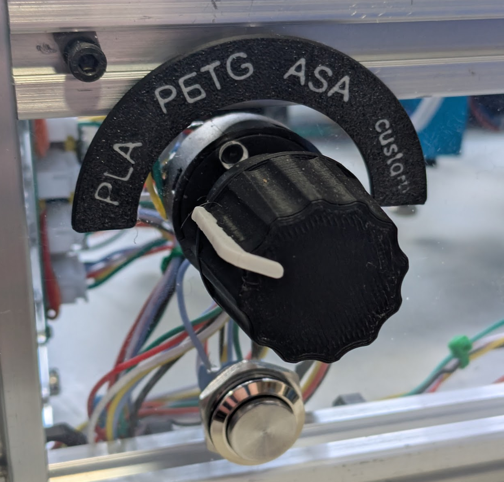
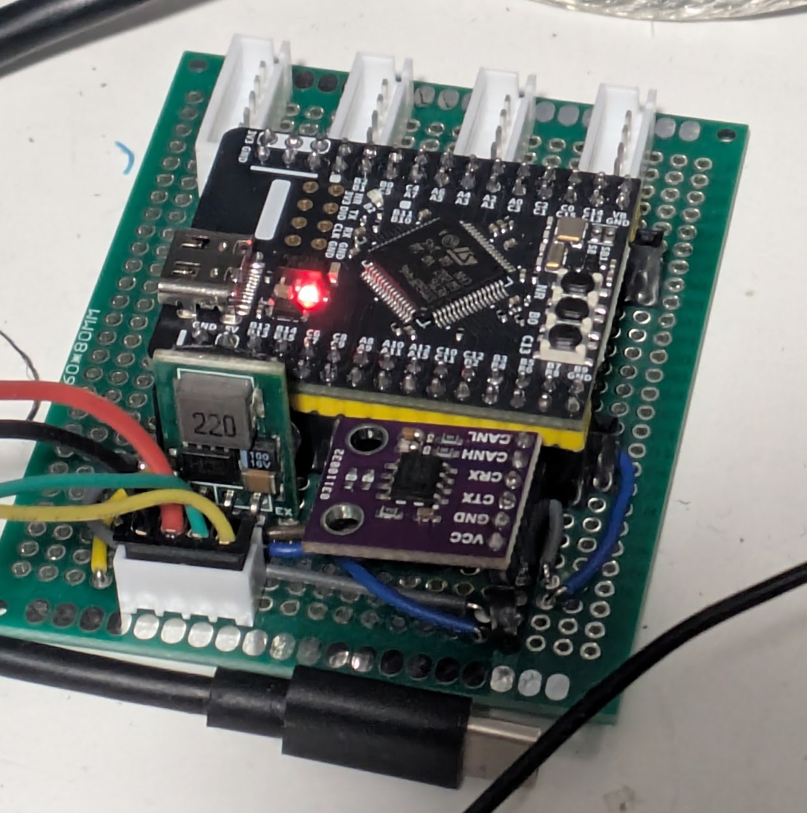

# MaterialSelector
This Klipper plugin lets you use physical switches to set filament types in Happy Hare or AFC. It pairs nicely with my [SpoolVision](https://github.com/robotfishe/SpoolVision) plugin for automated colour detection, but can be used independently.



To install, just download material_selector.py and put it in your klipper/klippy/extras directory.

You can technically use any kind of switch that will flip a GPIO pin to low, but I recommend [these selector switches](https://www.aliexpress.com/item/1005010543990954.html), which are available with anywhere from 2 to 8 positions.

The common contact on each switch should be wired to ground, and each of the other contacts to a different GPIO. You can then define a material_selector section in your printer config for each lane - for example:

```
[material_selector lane1]
preset1_pin: ^!selector:PB5
preset1_material: PLA
preset2_pin: ^!selector:PC1
preset2_material: PETG
preset3_pin: ^!selector:PA3
preset3_material: ASA
custom_pin: ^!selector:PC13
```
One switch must define a "custom" signal which will clear the MaterialSelector input so you can enter material details through KlipperScreen, Mainsail/Fluidd, etc.

Obviously this will use up a lot of GPIO pins, so you will probably need an additonal MCU board to handle them. The good news is because this board will only be handling switch inputs, you have some very inexpensive options. This [STM32 board from WeAct](https://www.aliexpress.com/item/1005006342506388.html) (I'm using the F446 variant) is a great option - for less than £5 (or $6), you get dozens of GPIOs. Documentation is minimal and there are some pins that don't work as inputs, so you will need to do some trial and error.

<details>
  <summary>Pins confirmed working on STM32F446 (click to expand):</summary>
  - PA0
  - PA2
  - PA3
  - PA7
  - PA10
  - PA12
  - PB0
  - PB1
  - PB2
  - PB5
  - PB10
  - PB12
  - PB14
  - PC1
  - PC2
  - PC4
  - PC6
  - PC8
  - PC10
  - PC13
</details>

You can use the above boards over USB or CAN. CAN will require a transceiver module like [this one](https://www.aliexpress.com/item/1005006938593904.html).

I'm thinking I might design a breakout board PCB in the future that will be a bit more plug-and-play, but at the moment the best way to do this is with a bit of protoboard.



If you're going to use one of these over CAN, make sure you have a voltage regulator somewhere in the mix as neither the STM32 dev board nor the CAN transceiver can handle 24V!

Once you're all set up, all you need to do is move the selector to the appropriate spot after you load your filament, and the plugin will update the material type in software for you!
